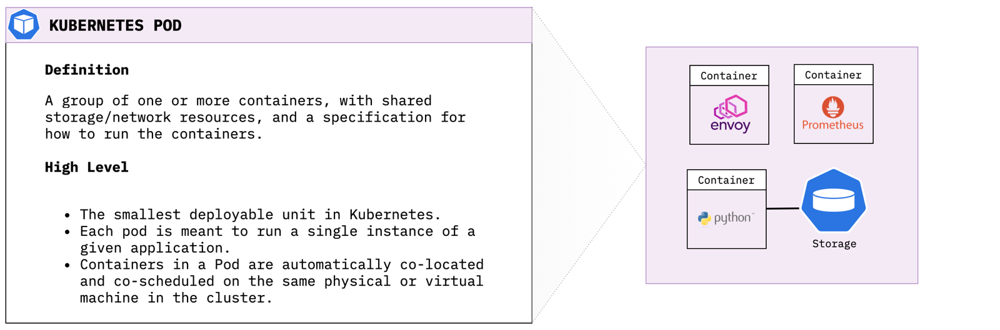
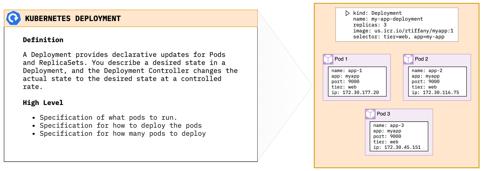
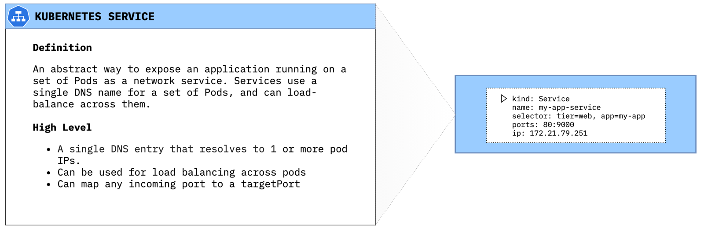
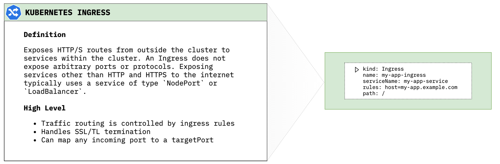

# Overview
Kubernetes is a container orchestrator to provision, manage, and scale applications. In other words, Kubernetes allows you to manage the lifecycle of containerized applications within a cluster of nodes (which are a collection of worker machines, for example, VMs, physical machines etc.).

Kubernetes does not have the concept of an application. It has simple building blocks that you are required to compose. Kubernetes is a cloud native platform where the internal resource model is the same as the end user resource model.

## Key Components of Kubernetes

### Pods
A Pod is the smallest object model that you can create and run. You can add labels to a pod to identify a subset to run operations on. When you are ready to scale your application you can use the label to tell Kubernetes which Pod you need to scale. When we talk about a application, we usually refer to group of Pods. Although 
an entire application can be run in a single Pod, we usually build multiple Pods that talk to each other to make a useful application



**Creating a Kubernetes Pod**
Use the following command to launch a simple busybox container as a Kubernetes pod:

```shell
cat <<EOF | kubectl apply -f -
apiVersion: v1
kind: Pod
metadata:
  name: busybox-sleep
spec:
  containers:
  - name: busybox
    image: busybox
    args:
    - sleep
    - "1000000"
EOF
```

**Describe Pod Resource**
Use the `kubectl describe` command to get more information about our running pod:

```shell
kubectl describe pod/busybox-sleep
```

While it is trivial to launch a pod within Kubernetes in order to scale I would need to manually create new pods everytime I need the service to be more elastic. This is where *Deployments* come in to play.

### Deployments
A Deployment provides declarative updates for Pods and ReplicaSets. You describe a desired state in a Deployment, and the Deployment Controller changes the actual state to the desired state at a controlled rate.



**Creating a Kubernetes Deployment**
Use the following command to launch a set of 3 nginx pods:

```shell
cat <<EOF | kubectl apply -f -
apiVersion: apps/v1
kind: Deployment
metadata:
  name: nginx-deploy
spec:
  replicas: 3
  selector:
    matchLabels:
      app: nginx
  template:
    metadata:
      labels:
        app: nginx
    spec:
      containers:
      - name: nginx-container
        image: nginx
        ports:
        - containerPort: 80
EOF
```

**Describe Deployment Resource**
Use the `kubectl describe` command to get more information about our new deployment:

```shell
kubectl get deployment.apps/nginx-deploy
```

Now if K8s sees that my nginx deployment only has 2 running pods, it will create an additional pod to meet the deployment specification. So I've now got my nginx containers running within my cluster, but how do outside users and other cluster resources find them? Enter *Services*.

### Services
A *Service* is an abstract way to expose an application running on a set of Pods as a network service. Services use a single DNS name for a set of Pods, and can load-balance across them. The set of Pods targeted by a Service is usually determined by a selector (in our case app=nginx).



**Deploying a service**
```shell
cat <<EOF | kubectl apply -f -
apiVersion: v1
kind: Service
metadata:
  name: nginx-svc
  labels:
    app: nginx
spec:
  selector:
    app: nginx
  ports:
   - protocol: TCP
     port: 80
EOF
```

**Describe Service Resource**
Use the `kubectl describe` command to get more information about our new service:

```shell
kubectl describe service/nginx-svc
```

One thing you will notice when looking at the service config is *Type: ClusterIP*. Kubernetes comes with 3 primary ways to expose resources via Services. If you do not specifically set a type, Kubernetes will default to ClusterIP.

#### ClusterIP
Exposes the Service on a cluster-internal IP. Choosing this value makes the Service only reachable from within the cluster. This is the default ServiceType.

#### NodePort
Exposes the Service on each Node's IP at a static port (the NodePort). A ClusterIP Service, to which the NodePort Service routes, is automatically created. You'll be able to contact the NodePort Service, from outside the cluster, by requesting <NodeIP>:<NodePort>.

**Deploying a NodePort type service**

```shell
cat <<EOF | kubectl apply -f -
apiVersion: v1
kind: Service
metadata:
  name: nginx-svc-np
  labels:
    app: nginx
spec:
  type: NodePort
  selector:
    app: nginx
  ports:
   - protocol: TCP
     port: 80
EOF
```

**Pull NodePort**
You can pull the assigned port using the `kubect get` command and `jq`:

```shell
kubectl get svc/nginx-svc-np -o json | jq -r '.spec.ports[]'
```

#### LoadBalancer
Exposes the Service externally using a cloud provider's load balancer. The NodePort and ClusterIP Services, to which the external load balancer routes, are automatically created when using `Type: LoadBalancer`.

**Deploying a LoadBalancer type service**

```shell
cat <<EOF | kubectl apply -f -
apiVersion: v1
kind: Service
metadata:
  name: nginx-svc-lb
  labels:
    app: nginx
spec:
  type: LoadBalancer
  selector:
    app: nginx
  ports:
   - protocol: TCP
     port: 80
EOF
```

**Find external loadBalancer IP**

```shell
kubectl get svc/nginx-svc-lb -o json | jq -r '.status.loadBalancer.ingress[].ip'
```

Use `curl` to verify connectivity from outside the cluster to your newly created Loadbalancer service. 

```shell
rtiffany@cloudshell:~$ kubectl get svc/nginx-svc-lb -o json | jq -r '.status.loadBalancer.ingress[].ip'
169.48.252.133

rtiffany@cloudshell:~$ curl 169.48.252.133
<!DOCTYPE html>
<html>
<head>
<title>Welcome to nginx!</title>
<style>
    body {
        width: 35em;
        margin: 0 auto;
        font-family: Tahoma, Verdana, Arial, sans-serif;
    }
</style>
</head>
<body>
<h1>Welcome to nginx!</h1>
<p>If you see this page, the nginx web server is successfully installed and
working. Further configuration is required.</p>

<p>For online documentation and support please refer to
<a href="http://nginx.org/">nginx.org</a>.<br/>
Commercial support is available at
<a href="http://nginx.com/">nginx.com</a>.</p>

<p><em>Thank you for using nginx.</em></p>
</body>
</html>
```

### Ingress
Exposes HTTP/S routes from outside the cluster to services within the cluster. An Ingress does not expose arbitrary ports or protocols. Exposing services other than HTTP and HTTPS to the internet typically uses a service of type `NodePort` or `LoadBalancer`.



**Deploy an ingress**
This will deploy a an ingress that says when traffic for *test-ingress.cdetesting.com* hits the cluster it will be routed to the service *nginx-svc* within the cluster. 

```shell
cat <<EOF | kubectl apply -f -
apiVersion: extensions/v1beta1
kind: Ingress
metadata:
  name: nginx-ingress
spec:
  rules:
  - host: test-ingress.cdetesting.com
    http:
      paths:
      - backend:
          serviceName: nginx-svc
          servicePort: 80
        path: /
EOF
```

**Pointing the domain at the cluster**
In order to get *test-ingress.cdetesting.com* to resolve to my Kubernetes cluster I created the CNAME *test-ingress* for the *cdetesting.com* domain and pointed it at my IKS ingress hostname. You can find your ingress hostname by running the following command:

```shell
ibmcloud ks cluster get --cluster devcluster --json | jq -r .ingressHostname
```

### Persistent Storage

### Namespaces

### Secrets

## Kubernetes application deployment workflow


1. User via "kubectl" deploys a new application. Kubectl sends the request to the API Server.
2. API server receives the request and stores it in the data store (etcd). Once the request is written to data store, the API server is done with the request.
3. Watchers detects the resource changes and send a notification to controller to act upon it
4. Controller detects the new app and creates new pods to match the desired number# of instances. Any changes to the stored model will be picked up to create or delete Pods.
5. Scheduler assigns new pods to a Node based on a criteria. Scheduler makes decisions to run Pods on specific Nodes in the cluster. Scheduler modifies the model with the node information.
6. Kubelet on a node detects a pod with an assignment to itself, and deploys the requested containers via the container runtime (e.g. Docker). Each Node watches the storage to see what pods it is assigned to run. It takes necessary actions on resource assigned to it like create/delete Pods.
7. Kubeproxy manages network traffic for the pods – including service discovery and load-balancing. Kubeproxy is responsible for communication between Pods that want to interact.

## Extending Kubernetes 
  - Sidecar container: a separate container that performs its own function distinct from the application container.
    - Istio uses a Sidecar proxy to mediate inbound and outbound communication to the workload instance it is attached to.
  - Custom Resource Definitions: 
    - IBM Cloud Databases use CRD's to deploy to the [IBM Cloud](http://example.com). 

# Videos / Tutorials / Labs

 - [Kubernetes Deconstructed (very good video)](https://vimeo.com/245778144/4d1d597c5e)
 - [IBM Kube101](https://github.com/ibm/kube101)
 - [IBM Istio101](https://github.com/ibm/istio101)
 - [Flask Python app on IKS](https://developer.ibm.com/tutorials/scalable-python-app-with-kubernetes/)